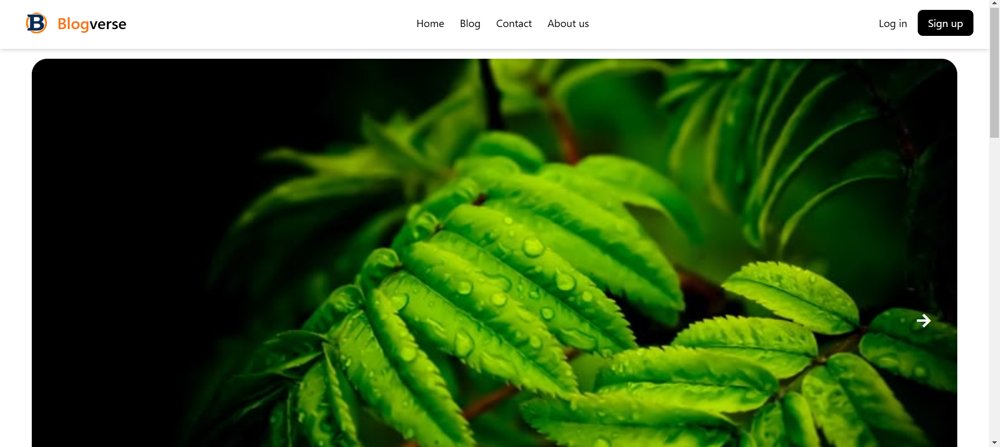
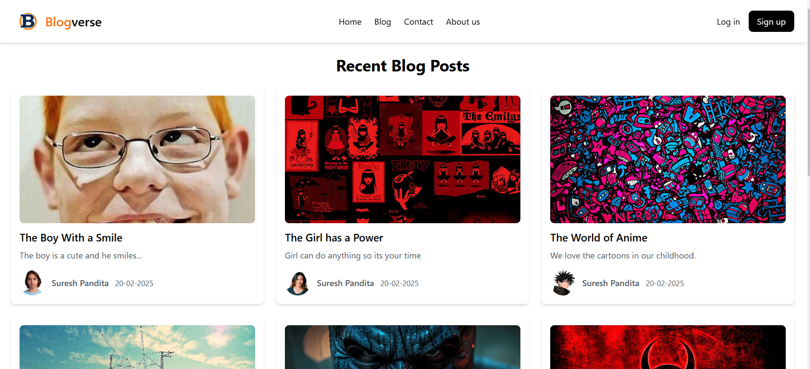
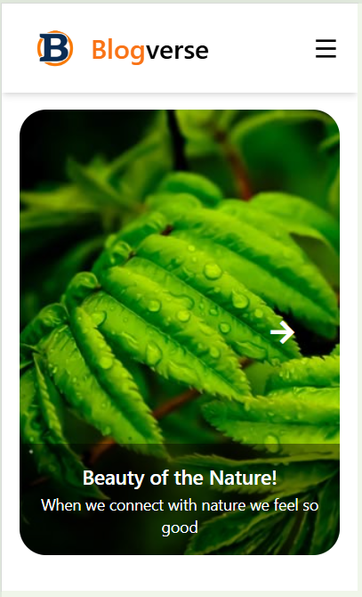

# BlogVerse

A **modern blog website** built with **React.js, Firebase, and Tailwind CSS**. BlogVerse allows users to create, read, update, and delete (CRUD) blog posts while managing images efficiently.

## 🚀 Features

- 📝 **User Authentication** (Login & Signup)
- 📄 **Create, Read, Update, Delete (CRUD) Blogs**
- 📸 **Image Upload and Management**
- 🎨 **Responsive UI with Tailwind CSS**
- 🔗 **React Router for Navigation**
- ⚡ **Fast & Secure with Firebase Backend**

## 📷 Screenshots

Here are some previews of the BlogVerse UI:

### Home Page


### Blog Page


### Login Page


### Mobile View



> **Note:** Place your UI screenshots inside the `assets/screenshots/` folder in your project directory.

## 🛠 Tech Stack

- **Frontend:** React.js, Tailwind CSS, React Router
- **Backend:** Firebase
- **State Management:** useState, useEffect
- **Icons:** Remix Icons

## 📂 Project Structure

```
BlogVerse/
│── public/
│── src/
│   ├── assets/
│   │   ├── collection/
│   │   ├── screenshots/   # Place your UI screenshots here
│   ├── components/
│   ├── pages/
│   ├── App.js
│   ├── index.js
│   ├── styles/
│── package.json
│── README.md
│── tailwind.config.js
│── vite.config.js
```

## 🏗 Installation

Follow these steps to set up the project on your local machine:

1. **Clone the Repository**
   ```sh
   git clone https://github.com/your-username/blogverse.git
   cd blogverse
   ```

2. **Install Dependencies**
   ```sh
   npm install
   ```

3. **Start the Development Server**
   ```sh
   npm run dev
   ```

4. **Open in Browser**
   ```
   http://localhost:5173
   ```

## 🔥 Deployment

You can deploy this project on **Vercel** or **Netlify**:

1. Build the project:
   ```sh
   npm run build
   ```
2. Deploy to Vercel:
   ```sh
   vercel
   ```

## 📜 License

This project is **MIT Licensed**. Feel free to use and modify it!

## 🤝 Contributing

Contributions are welcome! Feel free to **fork**, **clone**, and **submit pull requests**.

---

🚀 **Developed by [Your Name]**

Suresh Pandita